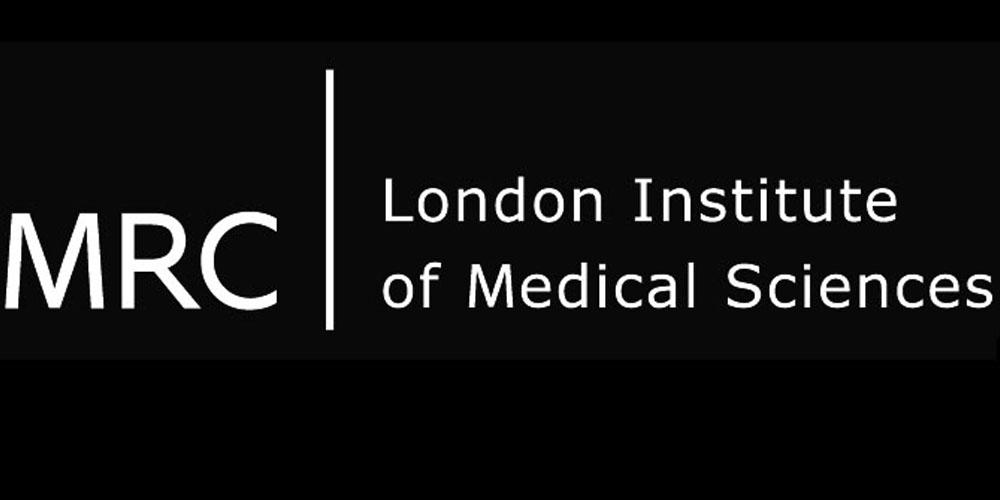

## Description

Modern genomics technologies are able to produce large volumes of data that often leave researchers feeling overwhelmed and unsure of how to begin the process of biological interpretation.

In this course, we explain the common file formats generated by sequencing technologies and how they can be manipulated and explored by non bioinformaticians. The tool that we will use is the Integrative Genomics Viewer (IGV) (http://software.broadinstitute.org/software/igv/).

If time allows, there will be time at the end of the session for you to explore your own datasets with the assistance of the instructors.

## Materials

Developed in collaboration between The University of Cambridge and MRC London Institute of Medical Sciences.

- [File formats for NGS data](fileFormats.pdf)
- [IGV Introduction](http://mrccsc.github.io/IGV_course/igv.html)
- [Practical Session for RNA-seq and ChIP-seq](IGV-practical.md)
- [Inspecting Variants in IGV](InspectingVariantsInIGV.md)

## Data

## Acknowledgements

We are grateful to the [Griffith Lab](http://genome.wustl.edu/people/groups/detail/griffith-lab/) for making their IGV tutorials available online
